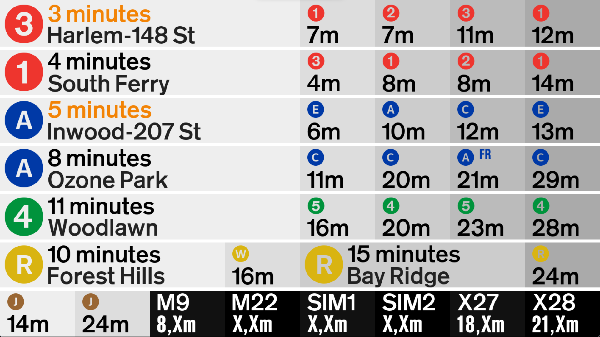

# STUA (Stuyvesant Transit and Urbanism) 
## The STUA Countdown Board Project

---

This is the Beta page for the STUA Countdown Board Project. In this branch contains testing models for the board.

Instructions for usage are the same as the board in the main branch.

Below are some images of our (not-confirmed) changes.

 

(STUA Board Display)
 
 
(From Before) "A main goal in our redesign process was to display as much information as possible in as little rotations as possible. In this way, students would not be clogging the second floor bridge entrance while waiting to view their transit information. Additionally, the board would need to take as little time as possible to download data from the MTA, so that there could be more frequent updates, and hence the information presented on the board would be more accurate. Lastly, we aimed to make the new design simply more appealing to the eye."
 
 
Complete Changlog:
 
- Crash Protection
- STUA Logo Scaling Fix
- Adjusted Critical Times
- Adjusted Club Logo